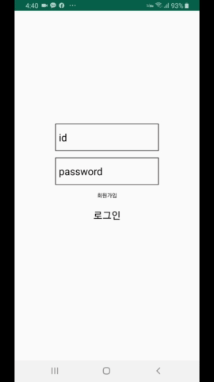
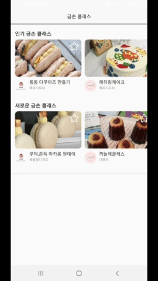

# 🐞 IT 창업 동아리 SOPT 25기 활동하며 한 과제들

 

## Homework1

💁 로그인, 회원가입 엑티비티 만들기 프로젝트

💁 리드미 --> [여기](https://github.com/choheeis/SOPT_25/blob/master/ReadmeCollection/Homework1.md)

 

## Homework2

💁 깃허브 팔로워, 레포지토리 뷰를 보여주는 엑티비티 만들기 프로젝트

💁 리드미 --> [여기](https://github.com/choheeis/SOPT_25/blob/master/ReadmeCollection/Homework2.md)

 

## IdusDesign

💁 안드로이드 파트 + 디자인 파트 합동 세미나 과제였던 "제플린을 사용하여 디자인 파트가 만들어온 UI를 협업을 통해 완성하기!"

💁 리드미 --> [여기](https://github.com/choheeis/SOPT_25/blob/master/%EB%A6%AC%EB%93%9C%EB%AF%B8%EB%AA%A8%EC%9D%8C%EC%A7%91/IdusDesign.md)

